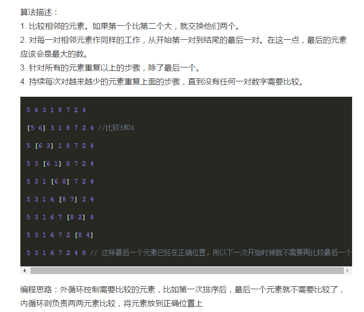
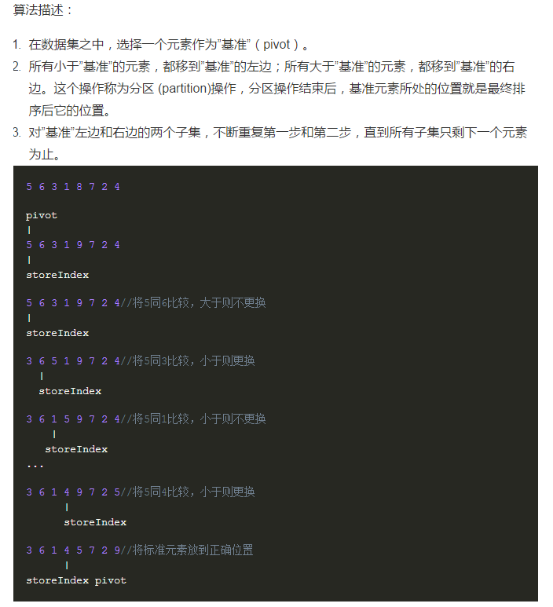

以下均为目标是从小到大的排序为例去分析

# 1.插入排序(时间复杂度O(n^2))

<image src="img/1.jpg">

# 2.选择排序(时间复杂度O(n^2))

<image src="img/2.jpg">

### 插入排序是把后面（未排序）的第一个 在前面的（已排序）中从后到前一个一个试试，在哪个位置合适

### 选择排序是把后面的（未排序）的最小的那个 直接放到前面的（已排序）的最后一个位置

# 3.归并排序(时间复杂度O(nlog(n)))

<image src="img/3.jpg">

# 4.冒泡排序(时间复杂度O(n^2))

# 5.快速排序()

